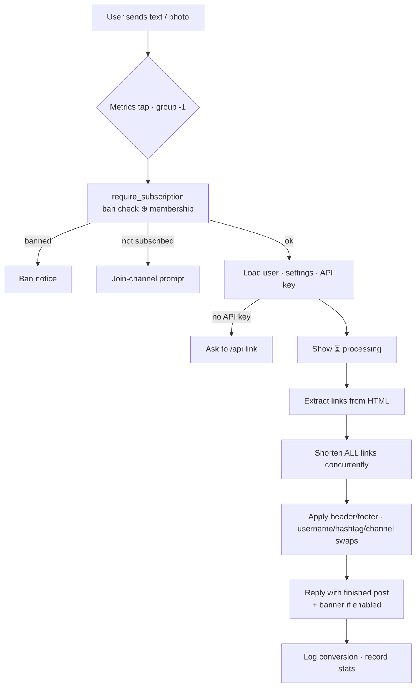

<div align="center">

# 🔗 LinkShortify Bot

### A production-grade Telegram bot that auto-shortens links via [linkshortify.com](https://linkshortify.com) and rebrands posts — so creators earn from every click.

<br>


</div>

---

## 📖 Table of Contents

- [What It Does](#-what-it-does)
- [Features](#-features)
- [Tech Stack](#-tech-stack)
- [How It Works](#-how-it-works)
- [Project Structure](#-project-structure)
- [Requirements](#-requirements)
- [Quick Start](#-quick-start)
- [Configuration](#-configuration)
- [Commands](#-commands)
- [Logging System](#-logging-system)
- [Performance & Optimizations](#-performance--optimizations)
- [Database](#-database)
- [Deployment](#-deployment)
- [Local Development](#-local-development)
- [Migration (MySQL → MongoDB)](#-migration-mysql--mongodb)
- [Troubleshooting](#-troubleshooting)

---

## 🎯 What It Does

A user links their LinkShortify account once (via API key), then forwards or types any post. The bot:

1. **Finds every link** in the text or photo caption (including hidden/hyperlinked ones).
2. **Shortens them all concurrently** through the LinkShortify API.
3. **Rebrands the post** — swaps usernames, hashtags, and channel links for the user's own, adds a custom header/footer, and optionally attaches a banner image.
4. **Sends the finished post back**, ready to publish — every click now earns the user money.

It also gates access behind channel membership, supports multiple admins, mass broadcasts, and logs everything to dedicated Telegram channels.

---

## ✨ Features

| | Feature |
|---|---|
| 🔗 | **Bulk link shortening** in any text post or photo caption |
| 🏷️ | **Custom alias shortening** with `url \| alias` syntax |
| ⬆️⬇️ | **Custom header & footer** prepended/appended per user |
| 👤 | **Username / hashtag / channel-link replacement** with your own |
| 🖼️ | **Custom banner image** attached to processed posts |
| ⚙️ | **One-tap settings panel** with inline toggles |
| 💰 | **Account & balance stats** pulled live from LinkShortify |
| 📢 | **Force-subscription gate** (must join your channel) |
| 🛡️ | **Multi-admin system** via env var |
| 🚫 | **Ban / unban** with user notification |
| 📣 | **Mass broadcast** by replying to any message |
| 📊 | **Three logging channels** — users, errors, admin actions |
| ⚡ | **Fully async** with connection pooling and concurrent processing |

---

## 🛠 Tech Stack

| Layer | Technology |
|---|---|
| **Language** | Python 3.13+ (`async`/`await` throughout) |
| **Bot framework** | [python-telegram-bot](https://docs.python-telegram-bot.org/) 22.x (long-polling, concurrent updates) |
| **Database** | MongoDB + [Motor](https://motor.readthedocs.io/) (async driver) — typically MongoDB Atlas |
| **HTTP client** | [httpx](https://www.python-httpx.org/) (pooled, async, retried) |
| **HTML parsing** | [lxml](https://lxml.de/) (fast link extraction) |
| **Config** | [python-dotenv](https://pypi.org/project/python-dotenv/) |
| **Metrics** | [psutil](https://pypi.org/project/psutil/) (memory/process stats) |
| **Deployment** | systemd · Docker |

---

## ⚙️ How It Works

### Message processing pipeline



### Request lifecycle

- **Middleware decorators** wrap handlers: `require_subscription` (ban + channel membership, both cached), `require_registered` (API key linked, caches the user doc), `require_admin` (admin allow-list).
- **Services** hold business logic: `api_client` (LinkShortify HTTP) and `shortener` (the pipeline, returning a `ProcessResult` with the converted links).
- **The DB layer** (`db.database`) is the *only* place MongoDB is touched — handlers and services never query Mongo directly.
- **Logging** runs through one centralized funnel that writes to terminal, a rotating file, and the relevant Telegram channel.

---

## 📂 Project Structure

```
linkshortify-master/
├── run.py                      # Entry point  →  python run.py
│
├── deploy/                     # Everything needed to ship it
│   ├── install.sh              #   one-command installer + systemd setup
│   ├── Dockerfile              #   container image (MongoDB/Motor)
│   └── linkshortify-bot.service#   systemd unit template
│
└── app/                        # Application package
    ├── bot.py                  #   Application setup, error handler, main()
    ├── config.py               #   centralized env-var configuration
    ├── messages.py             #   ALL user-facing strings (no hardcoded text)
    │
    ├── core/
    │   ├── middleware.py       #   subscription (cached) / auth / admin decorators
    │   ├── logging.py          #   terminal + rotating-file logging setup
    │   └── metrics.py          #   in-memory runtime counters (shown in /status)
    │
    ├── handlers/
    │   ├── __init__.py         #   register_handlers(app) + metrics tap
    │   ├── user.py             #   user commands & settings toggle
    │   ├── admin.py            #   admin commands (ban, broadcast, status)
    │   └── message.py          #   text & photo processing
    │
    ├── services/
    │   ├── api_client.py       #   LinkShortify HTTP client (pooled, retried)
    │   └── shortener.py        #   concurrent pipeline → ProcessResult
    │
    ├── utils/
    │   ├── html_parser.py      #   link extraction from Telegram HTML
    │   ├── text_filters.py     #   regex replacements
    │   ├── logger.py           #   escaped + retried Telegram logging
    │   └── processing.py       #   one-active-"⏳"-message-per-user manager
    │
    └── db/
        ├── __init__.py         #   Motor client factory (single pool)
        └── database.py         #   full database abstraction layer
```

---

## 📋 Requirements

- **Python 3.13+**
- **A MongoDB database** — [MongoDB Atlas](https://www.mongodb.com/atlas) (free tier works) or self-hosted MongoDB 6+
- **A Telegram bot token** from [@BotFather](https://t.me/BotFather)
- **A LinkShortify account** for the API
- Linux server with `systemd` (for production) — or Docker

> ⚠️ **Disable the bot's privacy mode** in @BotFather (`/setprivacy` → Disable) if you want it to read messages in groups. For DM usage it's not required.

---

## 🚀 Quick Start

```bash
# 1. Clone
git clone <repo-url>
cd linkshortify-master

# 2. Configure
cp .env.example .env
nano .env                 # fill in BOT_TOKEN, MONGODB_URI, ADMINS, log groups…

# 3. Install & run (Linux + systemd, one command)
sudo bash deploy/install.sh
```

`install.sh` installs Python if missing, creates a virtual environment, installs dependencies, and registers + starts a `systemd` service. That's it. 🎉

> Prefer to run it by hand or use Docker? See [Local Development](#-local-development) and [Deployment](#-deployment).

---

## 🔧 Configuration

Copy `.env.example` → `.env` and fill in the values.

### Required

| Variable | Description |
|---|---|
| `BOT_TOKEN` | Telegram bot token from @BotFather |
| `MONGODB_URI` | MongoDB connection string (e.g. `mongodb+srv://…`) |
| `ADMINS` | Comma-separated admin Telegram user IDs |

### Bot behaviour

| Variable | Default | Description |
|---|---|---|
| `MONGODB_DB_NAME` | `linkshortify` | Database name |
| `CHANNEL_USERNAME` | — | Channel users must join (e.g. `@mychannel`); empty disables the gate |
| `OWNER_CONTACT` | `@LinkShortifySupport` | Support handle shown in messages |
| `LINKSHORTIFY_API_URL` | `https://linkshortify.com/api` | Shortening endpoint |
| `LINKSHORTIFY_STATS_URL` | `https://linkshortify.com/stats` | User stats endpoint |
| `PROCESSING_MESSAGE_ENABLED` | `true` | Show the "⏳ Processing…" message |
| `BROADCAST_BATCH_SIZE` | `25` | Users per broadcast batch |

### Logging channels

| Variable | Description |
|---|---|
| `USER_LOG_GROUP` | Channel ID for user activity (new users, API links, conversions) |
| `ERROR_LOG_GROUP` | Channel ID for exceptions with stack traces |
| `ADMIN_LOG_GROUP` | Channel ID for admin actions |

> The bot must be an **admin** in each log channel. IDs look like `-1003757640777`.

### Performance & observability

| Variable | Default | Description |
|---|---|---|
| `ENVIRONMENT` | `production` | Label shown in error logs |
| `API_TIMEOUT` | `15` | External API timeout (seconds) |
| `API_RETRIES` | `2` | Transient-failure retries for API calls |
| `SUB_CACHE_TTL` | `300` | Subscription-check cache TTL (seconds) |
| `BAN_CACHE_TTL` | `60` | Ban-status cache TTL (seconds) |
| `LOG_DIR` | `logs` | Directory for the rotating log file |
| `LOG_FILE` | `bot.log` | Log file name |
| `LOG_LEVEL` | `INFO` | Root log level |

---

## 💬 Commands

### 👤 User Commands

| Command | Description |
|---|---|
| `/start` | Welcome message; `/start <api_key>` (deep link) connects an account |
| `/help` | List all commands |
| `/about` | Bot info, version, and links |
| `/features` | Full feature list |
| `/api` | How to connect your LinkShortify account |
| `/logout` | Unlink your account |
| `/account` | Account details + referral link |
| `/balance` | Publisher & referral earnings, available balance |
| `/settings` | Inline panel to toggle every feature on/off |
| `/header <text>` | Set header text · `/header remove` to clear |
| `/footer <text>` | Set footer text · `/footer remove` to clear |
| `/username @handle` | Replace all @mentions with yours |
| `/hashtag #tag` | Replace all #hashtags with yours |
| `/channel_link t.me/x` | Replace all channel links with yours |
| `/banner_image <url>` | Set a banner image URL — or reply to a photo with `set_image` |

**Alias shortening:** send `https://example.com | myalias` to shorten with a custom alias.

### 🛡️ Admin Commands

> Available only to user IDs listed in `ADMINS`.

| Command | Description |
|---|---|
| `/ban <id> <reason>` | Ban a user and notify them |
| `/unban <id>` | Lift a ban and notify the user |
| `/broadcast` | **Reply** to any message, then send `/broadcast` to send it to all users |
| `/status` | Live stats: users, links, messages, session metrics, uptime, memory, MongoDB health |

---

## 📊 Logging System

All logging flows through **one centralized funnel**. Every dynamic value is HTML-escaped before being sent (unescaped tracebacks contain `<module>`, `<`, `>`, `&` and make Telegram reject the message — the classic cause of "missing" error logs). Telegram sends are **retried** and **never block** a handler.

```
            ┌─────────────┐
  event ──▶ │   logger    │ ──▶  Terminal (stdout / journald)
            │  (escaped,  │ ──▶  Rotating file  (logs/bot.log, 5 MB × 5)
            │   retried)  │ ──▶  Telegram log channel
            └─────────────┘
```

| Channel | What gets logged |
|---|---|
| **🟢 User Logs** | • New user — **first `/start` only** (deduplicated at the DB level)<br>• API linked (with masked key)<br>• Link conversion (type, count, original → short) |
| **🔴 Error Logs** | Every handler exception, background-task exception, API/DB failure — with full stack trace, source `file:line`, user, action, and environment |
| **🛡️ Admin Logs** | Ban · Unban · Broadcast started (content summary) · Broadcast completed (success / failed / blocked / duration) · Status |

> **Errors are written to terminal + file *first*, then Telegram** — so a Telegram outage can never make an error disappear. New-user events fire **exactly once, ever**, because a user document is created on first contact regardless of whether they link an API key.

---

## ⚡ Performance & Optimizations

This bot is tuned for fast response times and minimal redundant work:

| Optimization | Impact |
|---|---|
| **Persistent pooled HTTP client** | Reuses TCP/TLS connections — no handshake per link |
| **Concurrent link shortening** (`asyncio.gather`) | A post with N links shortens in ~1× latency, not N× |
| **`concurrent_updates(True)`** | Multiple users processed in parallel, not queued |
| **Subscription cache** (TTL) | Skips a Telegram `getChatMember` call on every message |
| **Ban-status cache** (TTL + invalidation) | Skips a DB query on every message |
| **Cached user doc** | `/account` & `/balance` reuse the doc from middleware (no double read) |
| **Atomic settings toggle** | One `findOneAndUpdate` instead of read-then-write |
| **Single combined stats write** | Messages + links counted in one `$inc`, *after* the reply is sent |
| **Photo resend by `file_id`** | Re-shares the original photo with zero download/re-upload |
| **Banner sent by URL/`file_id`** | Telegram fetches it directly — no proxy download |
| **Fire-and-forget logging** | Log channel latency never delays the user's reply |
| **API timeout + retry** | No external call hangs indefinitely; transient blips auto-retry |

---

## 🗄 Database

MongoDB collections (created automatically; indexes ensured on startup).

### `users`

| Field | Type | Notes |
|---|---|---|
| `telegram_id` | int | **unique index** |
| `api_key` | string | **unique sparse index** |
| `email`, `site_username` | string | from LinkShortify |
| `first_name`, `username` | string | from Telegram |
| `settings` | object | per-user feature settings (below) |
| `created_at` | datetime | **indexed** — set once on first `/start` |
| `updated_at` | datetime | last modification |

**`settings` sub-document**

```
header_text · footer_text · username_replace · hashtag_replace ·
channel_link · banner_image                              ← stored values
header_enabled · footer_enabled · username_enabled ·
hashtag_enabled · channel_enabled · banner_enabled       ← boolean toggles
```

### `bans`
`telegram_id` (unique index) · `reason` · `banned_by` · `created_at`

### `broadcasts`
`initiated_by` · `success_count` · `failed_count` · `timestamp` (indexed)

### `stats`
Single document (`_id: "global"`): `total_links_shortened` · `total_messages_processed`

---

## 🚢 Deployment

### One-command install (recommended)

```bash
sudo bash deploy/install.sh
```

Then manage the service:

```bash
sudo systemctl status linkshortify-bot     # health
sudo journalctl -u linkshortify-bot -f      # live logs
sudo systemctl restart linkshortify-bot     # restart
sudo systemctl stop linkshortify-bot        # stop
```

### Updating an existing deployment

```bash
cd /path/to/linkshortify-master
git pull
sudo bash deploy/install.sh        # re-installs deps & regenerates the unit
# (or just: sudo systemctl restart linkshortify-bot)
```

### Manual systemd setup

Edit `deploy/linkshortify-bot.service` (replace `YOUR_USER` and the paths), then:

```bash
sudo cp deploy/linkshortify-bot.service /etc/systemd/system/
sudo systemctl daemon-reload
sudo systemctl enable --now linkshortify-bot
```

### Docker

```bash
docker build -f deploy/Dockerfile -t linkshortify-bot .
docker run -d --restart unless-stopped --env-file .env --name linkshortify linkshortify-bot
```

---

## 💻 Local Development

```bash
python3.13 -m venv .venv
source .venv/bin/activate
pip install -r requirements.txt
cp .env.example .env        # fill in your values
python run.py
```

> Logs print to the terminal and to `logs/bot.log`. Only **one** instance may poll a given bot token at a time — running locally while the server runs the same token causes a `Conflict: terminated by other getUpdates` error.

---

## 🔄 Migration (MySQL → MongoDB)

v2.0 replaced MySQL/SQLAlchemy with MongoDB/Motor. Map legacy columns as follows, then `mongoimport`:

| MySQL `users` | MongoDB |
|---|---|
| `telegram_id` | `telegram_id` |
| `user_api` | `api_key` |
| `email` | `email` |
| `site_username` | `site_username` |
| `header` / `footer` | `settings.header_text` / `settings.footer_text` |
| `username` / `hashtag` | `settings.username_replace` / `settings.hashtag_replace` |
| `channel_link` / `banner_path` | `settings.channel_link` / `settings.banner_image` |

| MySQL `usermeta` | MongoDB |
|---|---|
| `is_header` / `is_footer` | `settings.header_enabled` / `settings.footer_enabled` |
| `is_username` / `is_hashtag` | `settings.username_enabled` / `settings.hashtag_enabled` |
| `is_channel_link` / `is_banner` | `settings.channel_enabled` / `settings.banner_enabled` |

```bash
mongoimport --db linkshortify --collection users --file users.json --jsonArray
```

---

## 🩺 Troubleshooting

| Symptom | Fix |
|---|---|
| **Bot won't start** | Check `BOT_TOKEN` and `MONGODB_URI` in `.env`. Read `journalctl -u linkshortify-bot -f`. |
| **`Conflict: terminated by other getUpdates`** | Another instance is polling the same token. Stop all others (`pkill -f run.py`) — only one may run. |
| **No response to messages** | Confirm only one instance is running and the webhook is empty (`getWebhookInfo`). |
| **MongoDB auth/SSL errors** | Verify the URI password (URL-encode special chars like `#` → `%23`) and that your server IP is allow-listed in Atlas. |
| **Force-sub not working** | Make the bot an **admin** of `CHANNEL_USERNAME`. |
| **No logs in a channel** | The bot must be an **admin** of that log channel, and the group ID must be correct. |
| **Errors in terminal but not in the Error channel** | The bot isn't an admin of `ERROR_LOG_GROUP`, or the ID is wrong — content is always escaped, so formatting is no longer the cause. |
| **Broadcasts show failures** | Expected for users who blocked the bot — counted as `blocked`/`failed`, the bot keeps going. |

---

<div align="center">

**LinkShortify Bot v2.0** · Built with ❤️ for content creators

</div>
